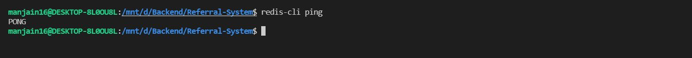
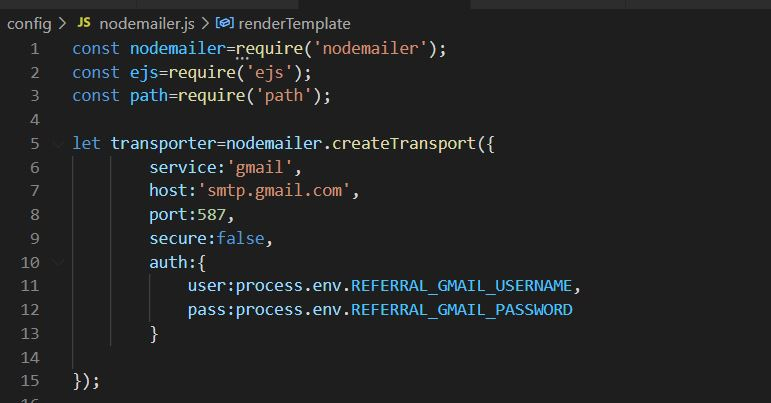

# Referral System

This is a clone of a referral portal. It allows employees to get the personalized referral code to refer their friends or families.
It gives incentives to both the referee and the employee. It also depicts referral history and giving an option to the employees/referees to withdraw from the referral system if they want to.
<br>
It also sends out <b>emails and notifications</b>. Kindly request you
to use real email addresses to see the effect.
<br>
This project uses  Node Js for the backend and Mongo DB for the database.

<br>

## Installation

- First download or clone the project
- Install NVM (Ubuntu/WSL in VS Code)

```
curl -o- https://raw.githubusercontent.com/nvm-sh/nvm/v0.38.0/install.sh | bash

export NVM_DIR="$([ -z "${XDG_CONFIG_HOME-}" ] && printf %s "${HOME}/.nvm" || printf %s "${XDG_CONFIG_HOME}/nvm")"
[ -s "$NVM_DIR/nvm.sh" ] && \. "$NVM_DIR/nvm.sh" # This loads nvm
```

- To install Node

```
nvm install 10.19.0
```

- Please download mongo db on your system by this <a href="https://docs.mongodb.com/manual/tutorial/install-mongodb-on-ubuntu/">Link</a> or you can also use your atlas account. 


- To install redis-server for sending out mails.
```
sudo apt-get update
sudo apt-get install redis-server
```

After this command, you can cross-check whether redis-server has been
properly installed or not:
```
redis-cli ping
```


- You can use your own gmail address and password to send out emails by replacing these lines 11 and 12 by your info.




- Open the project directory on cmd prompt and install nodemon
``` 
npm install -g nodemon
```

- To install remaining dependencies
```
npm install
```
<br>

## To start the project
<br>

- Open one terminal
```
npm start
```
- Open other terminal
```
redis-server
```

- Run the code on http://localhost:8000/
<br><br>

## For further assistance please reach me @ manjarijain98@gmail.com

